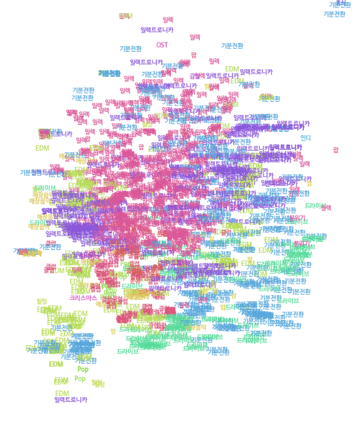
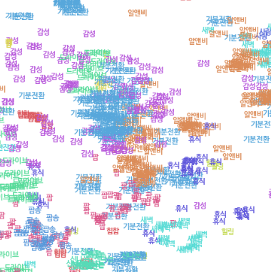
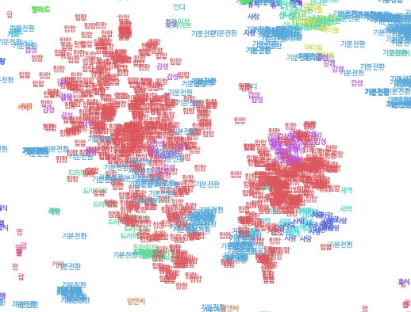
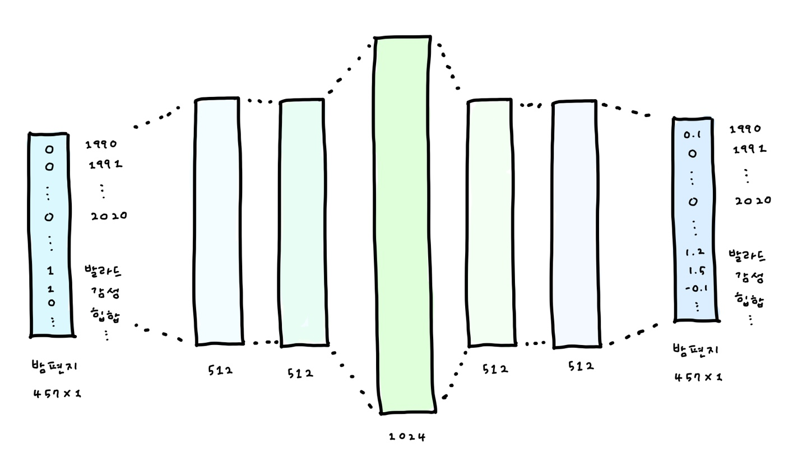
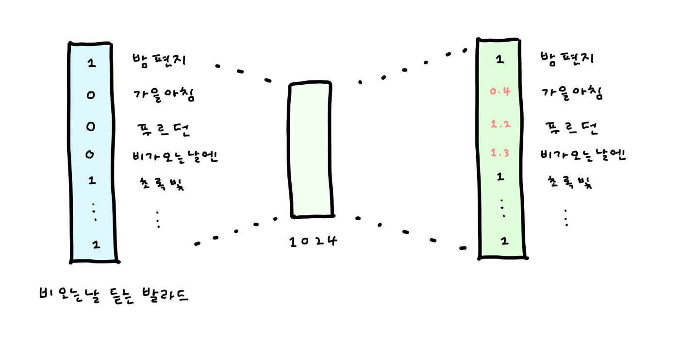
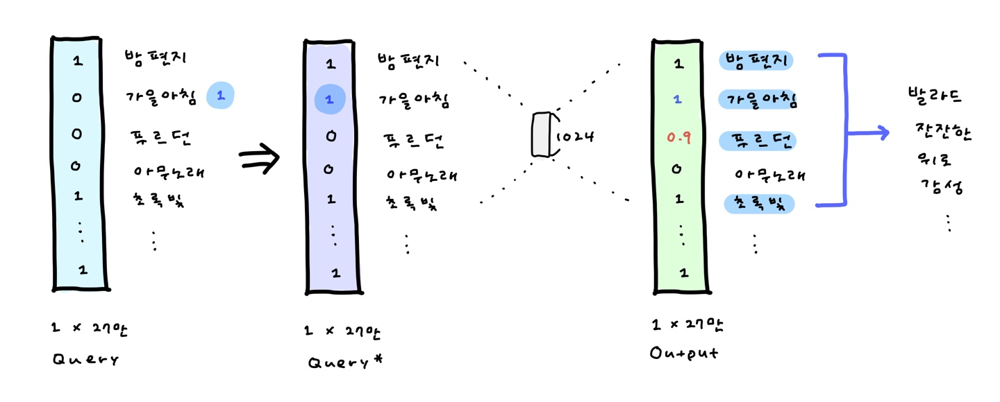
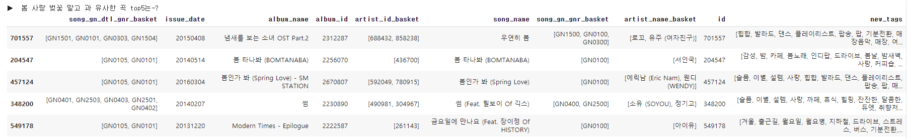
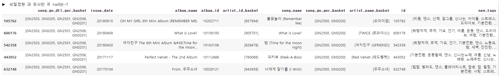
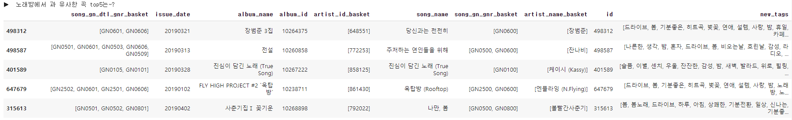
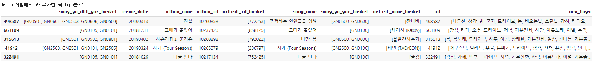

**:melon: Melon playlist continuation :musical_note:**

:heavy_check_mark: [GitHub에서 확인하기 (model1-2) ](https://github.com/haeuuu/RecSys-For-Melon-playlist-continuation)

:heavy_check_mark: [Tistory에서 확인하기](https://hhhaeuuu.tistory.com/category/%F0%9F%92%96%20Project/%5BRecSys%5D%20Melon%20Playlist%20Continuation)

 

# 1. Cluster 기반 Matrix Factorization

> #### Keywords
>
> `Matrix Factorization` `ALS` `PCA` `K-means clustering` `SVD`


`playlist`를 `user`로, k-means clustering으로 얻어낸 새로운 장르(군집)을 `item`으로 보고 `user-item matrix`를 생성하여 MF를 통해 적절한 군집을 추천합니다.


## Introduction

`축 처진 퇴근길을 위한 그루브`, `기분 좋은 밤 산책을 위한 적당한 텐션의 음악`, `무드등 켜고 혼술하며 듣는 감각적인 그루브` ...

이렇게 만들어진 플레이 리스트가 과연 오직 30개의 장르에만 의존할까요?

실제 유저들은 대분류 30개나 소분류 224개보다도 **더 세세하게 , 그리고 장르가 아닌 새로운 기준에 따라 음악을 분류할 것**이라고 생각했습니다.

K-means clustering을 통해 **더욱 세분화된 장르 군집 1000개**를 찾고, 각 군집 내에서 상위 노래를 추천합니다.


## Preprocessing

> 노래의 meta 정보에 playlist에서 추출한 태그 정보를 이용하여 one-hot vector ( d = (n , 457) ) 를 생성합니다.


**사용한 feature : 년 / 월 / 장르 대분류 / 장르 소분류 / 고빈도 태그**

1. Issue data를 년/월로 잘라 총 96개의 범주를 생성

   ##### 결측치 처리

   - 월 정보가 `00` 이거나 `51`인 경우, 또는 년도가 `0000`이거나 `2020`인 노래가 존재한다.
   - 총 2801개의 결측치 중에서 **해당 노래가 포함된 앨범을 찾아** 총 8개의 결측치를 채웠다.
   - 나머지 결측치에 대해서는 정보 손실을 감안하고 `0000/00/00`으로 수정하여 년도 범주와 월 범주에 각각 `0000`,`00`을 추가하였다.

   ##### 월로 잡을 수 있는 정보와 년도로 잡을 수 있는 정보는 다르다.

   - 6~7월에는 여름에 듣기 좋은 댄스곡이, 12월에는 크리스마스를 겨냥한 캐롤이 발매된다. 월/계절 정보가 핵심이 된다.
   - 제국의 아이들 등 오래전 아이돌 노래를 위한 플레이 리스트 또는 80년대 추억의 노래 등은 년도 정보가 중요한 역할을 한다.

2. 같은 앨범에 있는지 아닌지에 대한 정보는 사용하지 않았다.

   - 동일 앨범 id를 가진 노래의 갯수에 대해 3분위수(75%)값이 2였다.

     즉 대부분이 다른 앨범에 들어가 있기 때문에 앨범 정보는 유용하지 않다고 판단하였다.

   - 또한 같은 앨범일지라도 다양한 장르와 분위기의 노래가 수록된다. 제외한다.

3. 소분류, 대분류 정보 30 + 224개를 이용한다.

4. train set을 이용하여 노래에 tag를 매칭시킨다.

   * 해당 노래가 속한 play list를 모두 찾아 태그를 추출한다.
   * 이 때 tag는 train data 전체에서 가장 많이 등장한 상위 110개만을 사용하였다.


## PCA를 통한 차원 축소

> PCA를 통해 중요한 feature만을 추출합니다.

* 457차원의 one-hot vector를 180차원으로 축소합니다.
* explained_variance_ratio = 0.9438


## K-means clustering

> k-means clustering을 통해 1000개의 새로운 장르를 추출합니다.


## cluster에 대한 EDA

**:thinking: cluster가 어떤 의미를 가질 수 있을까?**

댄스, 팝, 일렉트로닉 등 커다란 장르가 아닌 세세한 장르를 표현하기 위해 cluster의 개념을 도입하였다.

이는 단지 장르를 더 세세하게 구분하는 것과는 다른 의미를 갖는다.

댄스라는 큰 장르를 걸그룹 / 보이그룹 또는 EDM / 하우스 등으로 나누는 것이 아니라, `여행갈 때 듣고싶은 청량청량 cluster`, `우울할 때 힘이 나도록 도와주는 비타민 cluster` 등으로 나눠지기를 기대하였다. 이러한 군집화는 train set에서 추출한 tag 정보를 통해 가능할 것으로 예상하였다.

모든 play list들은 이렇게 만들어진 cluster의 결합으로 생성될 수 있다고 가정하였다. `비오는날 cluster` `쓸쓸한 발라드 cluster` `감성적인 인디 cluster` 가 모여 `비가 추적추적 오는 쓸쓸한 날 듣기 좋은 인디 음악` 리스트를 만들어낼 것으로 기대하였다 !


**군집 결과를 시각화 하면 다음과 같다.**

시각화를 위하여 각 cluster에서 대표곡 100곡(train에 많이 등장한 top100)을 추출하여 t-sne를 통해 2차원으로 축소하였다.

각 점은 곡을 의미하며, 점을 나타내는 tag는 해당 곡에 가장 많이 달린 tag를 사용하였다.


뚜렷하게 섬을 이루는 군집이 있는 반면, 서로 뒤엉켜 있는 군집도 존재한다. 전반적으로 발견한 몇개의 특성은 다음과 같다.

* 클래식, 재즈, CCM, 뉴에이지 등 일반적인 곡과는 뚜렷하게 다른 특성을 갖는 곡들은 동떨어진 덩어리를 이룬다.
* `기분전환` , `드라이브` 처럼 어떤 노래와도 이질감이 들지 않는 (상대적으로) 태그는 널리 분포해있다.
  * 드라이브 태그가 많이 달렸다고 할지라도, 랩과 함께하는 드라이브인지 잔잔한 새벽감성과 함께하는 드라이브인지에 따라 군집이 달라질 수 있다.


**:blue_car: 드라이브라고 다 같은 노래를 듣는건 아니야 !**

쨍쨍한 햇볕과 함께 달리며 듣고 싶은 노래와 시원한 밤공기를 맞으며 듣고 싶은 노래는 다르다 !

| 일렉과 함께하는 신나는 드라이브                              | 감성 R&B와 함께하는 그루비한 드라이브                        | 힙합과 함께하는 둠칫둠칫 드라이브                            |
| ------------------------------------------------------------ | ------------------------------------------------------------ | ------------------------------------------------------------ |
|  |  |  |


**:dancer: 시원한 힙합이 좋을까, 감성적인 힙합이 좋을까?**

1. 기분전환을 위해 드라이브 하며 듣고 싶은 힙합 cluster
2. 새벽 감성을 듬뿍 담은, 사랑을 노래하는 힙합 cluster




#### 물론 ...

결론부터 이야기하면 meta 정보 + tag > PCA > clustering > MF를 이용한 추천의 성능은 아주 좋지 않았다 ... ㅠㅠ

`nDCG = 0.04` 로 장르에 따라 노래를 추천하는 **baseline 코드의 점수와 같았다.**

위에서 생성된 cluster가 장르의 범주를 크게 벗어나지 못했던 것 같다. 내가 tag 정보만 포함했던 이유는 **tag를 통해서도 암묵적으로 어떤 노래들이 같이 담겼는지 말해줄 수 있을것이라고 생각했기 때문**이었다. 그러나 충분하지 못했던 것으로 보인다 !

내가 원하는대로 clustering하기 위해서는 tag만 쓸 것이 아니라 **어떤 노래들이 함께 담겼는지 즉 play list에 대한 정보도 더 적극적으로 포함**해야하지 않았을까? (이는 추후에 **model 3에서 다른 방법으로 시도**해보았다 ! )


비록 nDCG는 낮지만, 어떤 cluster를 추천해주었는지를 확인해보면 나름대로 **비슷한 결을 가진 노래**임을 확인할 수 있다.

처음에는 "그래도 비슷한 결을 가졌으면 나쁘지 않은거 같은데 ..." 싶었다. 

하지만 내가 추천 받는 사람의 입장이 되면 이야기가 달라진다. 나는 자주 '장르만 같다고 다 유사곡인가?' 하며 불만족 했던 경험이 있었다.

오직 tag만 이용하여 clustering하는 방법에는 개선이 필요하다는 생각이 든다 !

이후에 기술할 실험에서는 play list 정보도 포함하면서 새로운 방법으로 차원 축소를 시도한다.


## Training

`iplicit` 패키지를 이용하여 `latent factors = 128, regularization = 0.02, epochs = 100`으로 학습

* `user `: play list
  * 이 때 모든 play list를 사용하지 않고, 속한 노래가 100곡 이상인 9004개만을 선택하였다.
* `item `: k-means clustering을 통해 얻은 군집 1000개
* `rating `: 대표 cluster 15개를 선정하여 1/0로 부여


**Rating을 어떻게 부여할 것인가에 대한 실험**

1. j번째 cluster에 포함된 노래가 있다면 1 없으면 0을 부여한다.

2. j번째 cluster에 포함된 노래의 곡 수로 점수를 부여한다.
   1. 빈도 그대로 사용한다.
   2. play list간에 담긴 곡 수 차이로 인해 점수 격차가 심하므로 적절한 log 변환을 취한다.
      * 왜? : 유의미 하지 않은 작은 값들은 0에 가깝게 만들고, 일정 점수 이상을 가진 값들은 비슷한 정도로 만들어주기 위해서


다양한 방법을 실험해본 결과, 각 play list에서 **일부를 추출**하여 1/0을 부여하는 것이 가장 적절하다고 판단하였음.

* 평균 49개, 최대 139개의 cluster를 이용한다. play list를 대표할만한, 대부분의 곡을 포함시키는 cluster는 몇개일까?

  * **가장 많이 등장한 cluster 15개**만 모아 얼마나 대표할 수 있는지 통계값을 통해 알아보았다.
    15개 cluster만으로도 전체 play list의 25% 이상이 원래 곡의 59.4%를 , **50% 이상이 원래 곡의 71%를 포함**한다.

  * 즉 15개의 cluster만으로도 해당 play list의 특성을 대표할 수 있을것이라고 판단한다 !

* 각 play list마다 가장 많이 등장한 cluster top15를 골라 등장한 경우 1을, 그렇지 않은 경우 0을 부여한다.


## Evaluation

1. `playlist_id - cluster_id`가 되도록 validation에 대한 one hot vector를 생성한다.

2. MF로 적합된 `user-item matrix`와 내적한 후 가장 유사한 play list를 찾는다.

3. 해당 play list에서 가장 높은 점수를 가진 cluster부터 차례로 순회하면서 해당 cluster에 속한 top30(빈도 기준) 을 추천한다.

4. 노래 추천이 끝나면, 각 노래별로 train에서 매칭되었던 tag를 추출한 후 모아 빈도순으로 정렬한 후 top10을 추천한다.


## Score

```python
Music nDCG: 0.0410008
Tag nDCG: 0.20722
Score: 0.0659337
```


# 2. CB로 sparsity 해결을 시도한 AutoEncoder for CF


## Introduction

일반적으로 CB와 CF를 함께 쓴 추천 시스템이라고 한다면 CB로 일부를, CF로 일부를 추천한 후 합쳐서 제시한다.

그러나 CF 모델에 넣기에는 user가 가진 정보가 부족해서 노래를 제대로 추천해주지 못하는 경우가 생겼다.

CB만으로 추천한 모델보다는 CF를 이용한 모델이 점수가 더 높은데, CF는 tag 점수가 너무 약했다. 태그 점수도 올리면서 music nDCG까지 올릴 방법 + sparse함을 해결할 방법 을 생각해보다가 (모델은 바꾸지 않고) **CB를 통해 노래를 추천한 후, 이를 query에 결합하여 CF의 input으로 사용해보자** ! 하는 아이디어가 떠올랐다.

단순히 CB와 CF를 합친 것 보다 좋은 성능을 발휘했다 !


## 1 ) Content-based Recommendation

AutoEncoder를 이용하여 1024차원의 embedding vector를 생성하고 cosine similarity를 이용하여 유사한 노래를 찾는다.



1. 발매 년도, 발매 월, 장르, 고빈도 태그를 이용하여 457차원의 one-hot vector를 생성한다.

2. `457 > 512 > 512 > 1024 > 512 > 512 > 457` 으로 차원을 확장하였다가 줄이는 구조를 가진 AutoEncoder를 이용하여 학습한다.

   > decoder의 가중치는 encoder 가중치를 그대로 이용한다.

   ```python
   non_linearity_type = "relu"
   drop_prob = 0.8
   weight_decay = 0.0001
   lr = 0.0001
   num_epochs = 50
   batch_size = 128
   
   optimizer = optim.Adam()  
   loss = loss1 + loss2*3  where loss1 = nn.MSEloss(inputs, outputs, reduction = 'sum')
   							  loss2 = nn.MSEloss(inputs, outputs, reduction = 'mean')
   ```

3. encoder를 통해 song embedding을 추출한 후 cosine similarity를 계산하여 가장 유사한 노래부터 내림차순으로 정렬하여 저장한다.


## 2 ) Collaborative Filtering



1. 약 27개의 곡을 이용하여 one hot vector를 생성한다.

2. `277,218 > 1024 > 277,218` 구조의 AutoEncoder를 이용하여 학습시킨다.

   > encoder와 decoder 가중치는 독립적으로 학습한다.

   ```python
   non_linearity_type = "selu"
   drop_prob = 0.8
   weight_decay = 0
   lr = 0.2
   num_epochs = 45
   batch_size = 1024
   
   optimizer = SGD , momentum = 0.6
   loss = loss1 + loss2*50  where loss1 = nn.MSEloss(inputs, outputs, reduction = 'sum')
   						 	   loss2 = nn.MSEloss(inputs, outputs, reduction = 'mean')
   ```

   

## Evaluation

> sparse한 validation을 **Content-based recommendation을 통해 약간 더 dense하게 만들어 준 뒤 CF를 진행**합니다.



1. Query를 one hot vector로 만든다.

2. Query에 포함된 모든 곡에 대하여 각 1개 ~ 3개의 유사곡을 찾아 추천한다. `Content_based_recommendation`

3. `Content_based_recommendation`에 속한 곡을 이용하여 **Query vector를 채운다**. `Query*`

   > query에는 정보가 부족한 경우가 많다. **Content based로 추천한 결과를 Query에 더해줌으로써 CF 추천 결과의 성능을 높이고자 하였다.** 3번 과정을 통해 Query 내에 약 100개의 노래가 포함되도록 한다.

4. `Query*`를 AutoEncoder에 넣어 점수를 내림차순 한 후 노래를 추천한다.

5. 추천한 곡들과 가장 많이 매칭된 tag를 찾아 10개를 추천한다.


* 만약 Query에 노래가 없을 경우
  1. tag가 있다면 해당 tag와 많이 매칭된 곡을 찾아 100곡을 추천한다.
  2. tag가 없다면 train set에서 가장 많이 등장한 100곡을 찾아 추천한다.


## Score

```python
Music nDCG: 0.103753
Tag nDCG: 0.302064
Score: 0.133499
```


:raising_hand_woman: **둘 중 하나만을 이용하거나, 단순히 섞기만 해서는 위와 같은 점수를 낼 수 없다.**

Content-based의 결과를 Query vector에 포함해서 CF model에 넣는 방식이 미미하지만 성능 향상에 영향을 끼쳤다고 볼 수 있다.

1. **CF만을 이용해서 추천했을 경우** :  노래는 잘 맞추지만 태그 성능이 좋지 않음.

   ```python
   Music nDCG: 0.0984524
   Tag nDCG: 0.17614
   Score: 0.110106
   ```

2. **CB만을 이용해서 추천했을 경우** :  tag는 잘 맞추지만 노래 점수는 크게 하락함.

   ```python
   Music nDCG: 0.0675142
   Tag nDCG: 0.338713
   Score: 0.108194
   ```

3. **두 방법을 단순히 함께 이용한 경우** : 30곡 이하이면 2곡씩, 30곡 이상이면 1곡씩 CB로 추천, 나머지는 CF로 추천

   * CB로 많이 추천해줄 수록 tag 점수는 올라가지만 노래 점수는 하락함.
   * 노래 점수는 CF만을 쓴 것 이상으로 올라갈 수 없었음.

   ```python
   Music nDCG: 0.0890984
   Tag nDCG: 0.282032
   Score: 0.118038
   ```

   

# 3. 결합된 CB,CF와 AE를 이용한 유사곡 추천 모델


## Introduction

* 노래 embedding 자체에 user들이 제공한 정보를 포함할 수는 없을까?

* 장르가, 태그가 비슷한 노래 뿐만 아니라 meta 정보는 다를지라도 사용자들이 함께 듣는 노래들을 묶어주면 어떨까?

하는 아이디어에서 출발하였습니다.


[Training Deep AutoEncoders for Collaborative Filtering](https://arxiv.org/pdf/1708.01715.pdf) 에서 아이디어를 얻고, 논문에서 제시한 테크닉 중 일부만을 선택(아래서 자세히 기술)하여 song embedding을 얻고자 하였습니다.


논문의 conclusion에서는 이 모델을 item에 쓰는 것 보다 user에 쓰는 것을 추천하고 있습니다.

생각을 조금 전환하여 **song을 user로, meta 정보와 play list에 대한 정보를 item으로** 생각할 수 있겠다고 판단하였습니다.

만약 song1, song3, song10이 하나의 play list에 있다면, **함께 있는 song들을 "서로 취향이 비슷한 user"**라고 판단합니다.

**song1과 유사한 노래는 song3에게 추천해주어도 좋아할것이다! 라는 가정**을 세웠습니다.

song embedding을 통해 유사한 노래를 찾고, play list에 포함된 노래에서 유사곡을 k곡씩 골라 100곡을 채워 추천합니다.


## Training

**parameters**

```
layer_size = one_hot_encoding.shape[1]
hidden_layers = 24,684 > 2,048 > 1,024 > 2,048 > 24,684
non_linearity_type = "selu"
drop_prob = 0.8
weight_decay = 0.0001
lr = 0.0005
num_epochs = 50
aug_step = 1
batch_size = 2048
```

`RMSE loss: 1.650`


1. 논문에서 제시한대로 **negative part를 없애지 않는 selu**를 activation fuction으로 사용

   * epoch 30에서 relu를 사용한 모델과 비교한 결과 selu를 사용한 모델이 `True > True` 로 더 잘 예측하였음.

   * 예측 값이 0.5 이상일 경우 고득점으로 생각하고 어느정도 정답을 맞추었다고 가정한 후 평가.

     Relu를 사용한 경우에 1을 0 혹은 0.00x로 예측한 경우가 많았음. 1을 0.5 이상으로 맞춘 경우 역시 대부분 sample에서 50%를 넘지 못함.

     그러나 Selu를 사용한 경우에는 1을 0.5 이상으로 예측한 경우가 약 60%정도로 보임. 더 잘 학습되었다고 판단함.

2. Loss function을 수정
   * loss는 **Masked MSE** 이외에 일반적인 MSE를 wieghted sum해서 사용하였음 **(w1 = 15, w2 = 200)**
   * MMSE만 사용할 경우 모든 item을 1로 예측하는 경우가 생김.
     **rating이 0인 item도 적절히 예측하도록 만들기 위해서** MSE를 추가적으로 이용함.
   * 학습 초기에는 MMSE가 더 높으나(즉 학습 초반에는 1을 1로 잘 예측하지 못하고 있음.) 두 loss가 동시에 낮아지면서 차이가 미미해짐. 1을 맞추면서도 0을 모두 1로 예측하지 않도록 균형을 잡으며 학습할 것으로 기대하였음.

2. Re feeding을 하지 않았음.

   * Re feeding을 하는 가정은 <u>잘 학습된 AE의 경우 `AE(x*) = AE(x)`를 만족해야 한다</u>임.

     > 자세한 내용은 논문, 혹은 [리뷰 참고](https://hhhaeuuu.tistory.com/119)

   * 그러나 **song을 user로 보게 된다면 이를 만족하지 않아야 한다**고 생각하였음. 

   * 같은 장르, 같은 태그를 가졌다고 할지라도 어떤 play list에 담겨있는가를 통해 다른 embedding을 가져야 하는 것이 더 좋은 모델이라고 판단


## 유사곡 추출

cosine similarity를 이용하여 자기 자신을 제외한 유사곡을 100곡씩 추출하여 저장


**아이유의 봄 사랑 벚꽃 말고와 유사한 곡 top5**




**오마이걸의 비밀정원과 유사한 곡 top5**




**장범준의 노래방에서와 유사한 곡 top5**




#### :cake: 신기한점 한가지 ; 실제로 멜론에서 제공하는 유사곡 결과와 비슷했다 !

> cosine similarity가 아니라 그냥 dot product를 한 결과를 이용하면 다음처럼 유사곡 추천 결과가 약간 바뀐다.
>
> evaluation에 사용한 모델은 cosine similarity를 이용했다 !





장범준의 노래방에서의 유사곡을 누르면 꼭 태연의 사계가 함께 나왔다.

대체 장르도 가사 내용도 다른 이 두 곡이 왜 유사곡일까? 혼자 생각하다가 찾아낸 것이

1. 두 곡이 비슷한 시기에 발매되었다. 19년 2월과 3월
2. 두 곡 모두 장기간 상위권을 차지했다.

라는 공통점이었다 ! 이걸 깨닫고나니 **'멜론은 함께 많이 담으면 유사곡으로 생각하나보네?'** 하는게 내 결론이었다. top100을 듣는 사람도 많을 뿐더러 두 곡 모두 대중들에게 인기가 많았기 때문에 분명 다수의 플레이 리스트에 함께 들어가있었을 것이다.


그런데 내가 직접 구현한 "유사곡 찾기" 에서도 똑같은 결과가 나오다니 너무 너무 너무 신기했다 !!!

다시 들어가보니 태연의 사계는 더이상 추천되지 않는다. 들어갈 때마다 순서가 바뀌는데 계속 업데이트 되는건지 상위 k개에서 랜덤으로 골라주는건지는 아직 잘 모르겠다.

하지만 주저하는 연인들을 위해 / 그때가 좋았어는 멜론에 아직 있다.

어쨌든 내가 의문을 품었던 점이 이렇게 풀리다니 진짜진짜 너무 신기하고 재밌는 경험이다 ㅎㅎㅎ


## Evaluation

1. 노래가 없는 경우

   1. 태그가 있다면, 각 태그별로 가장 많이 매칭된 노래를 `tag_to_sid`에서 뽑아 채운다.
      추천된 노래를 기반으로 tag를 추출한다. 
      각 노래가 tag에 투표하고, 가장 많은 표를 받은 tag부터 top10을 선정한다. 노래가 tag에 투표하는 기준은 *해당 tag가 달린적이 있다/없다* 이다.

   1. 태그가 없다면, 가장 인기있는 노래`pop_songs`와 태그 `pop_tags`로 채운다.

2. 노래가 1곡 이상 있는 경우

   k곡씩 유사곡을 골라 100곡을 채우고, 추천된 노래를 기반으로 tag를 추출한다.
   ex ) 노래가 3곡 포함되어있다면, `[34,33,33]` 곡씩 유사곡을 추출한다.


## Score

세 개의 모델 중 가장 우수한 성능을 보여주었다 !

```python
Music nDCG: 0.107791
Tag nDCG: 0.338882
Score: 0.142455
```


# 소감 :sunrise_over_mountains:

실습 수업때도, 연구실에서도 항상 다짐했던 것이 있었는데 바로 '이론만 알지 말고 조그맣게라도 적용해보자!' 였다.

이론상으로는 별탈 없이 잘될거같지만 실제로 적용해보면 예상치 못한 부분에서 이런저런 문제를 만난다. 행렬이 너무 커진다던가, 모델이 너무 무거워진다던가, 혹은 데이터 가공부터가 난관인 경우도 있다. ( 코랩 프로를 사용하고 있음에도 불구하고 램을 수백번은 터뜨린거같다 ... ) 실습용으로 예쁘게 구성된 데이터와는 다르게 실제 데이터는 양에서도 희소성에서도 차이가 있다.

movielens 데이터를 이용하여 이론 공부와 조그마한 실습을 병행했는데 아무래도 모르는 영화가 대부분이다보니 EDA를 할 때도, 나만의 가설을 세울 때도, 추천 결과를 해석할 때도 어려움이 있었다. 내가 주도적으로 분석하고 모델을 진행시켜나간다는 느낌보다는 영화/감독/배우 등 정형화된 틀을 벗어나지 못하고 그대로 따라하고 있다는 느낌을 받았다.

좀 더 나에게 와닿는, 내가 약간의 지식도 가지고 있는 그런 데이터가 없을까 하다가 때마침 멜론 데이터를 만나게 되었다 !

직접 추천 결과를 확인할 때도 어떤식으로 추천되는지를 파악할 수 있어 훨씬 재미있었고, 내가 노래를 듣는 사람의 입장이 되어 여러가지 가설을 세울 때도 수월했다.

제대로된 첫 도전이기 때문에 '높은 점수를 얻어서 순위를 올리자'보다는 실제 데이터에 적용할 때 어떤 문제를 만날 수 있는지, 그리고 이를 해결하려면 어떤 테크닉을 써야 하는지 등을 얻어가야겠다는 목표를 가지고 천천히 도전했다.

낮은 점수로라도 제출을 해보고 싶었지만 연구 인턴에서도 진행하고 있는 것들이 있었기 때문에 기간을 맞추지 못해서 아쉽다.
