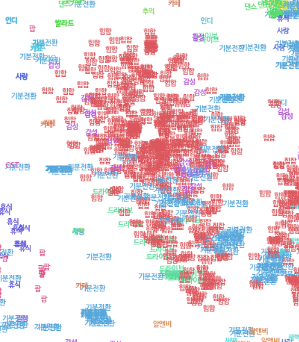

# Matrix Factorizaion for Playlist Continuation
다음 두가지 모델을 실험해보았습니다.
1. Cluster 기반 Matrix Factorization

   implicit의 ALS를 그대로 이용해서 구현해보았습니다.

   ```python
   Music nDCG: 0.0410008
   Tag nDCG: 0.20722
   Score: 0.0659337
   ```
2. BM25 기반 Matrix Factorization

   implicit-gpu의 **ALS를 custom**하여 구현해보았습니다.

   ```python
   Music nDCG: 0.178373
   Tag nDCG: 0.42701
   Score: 0.215669
   ```

<br></br>

## :a: Cluster 기반 Matrix Factorization

>  :computer: `코드 보러가기` [cluster 기반 MF 적합 결과 구경하기.ipynb](https://github.com/haeuuu/Alternating-LeastSquares-for-Playlist-Continuation/blob/master/cluster%20%EA%B8%B0%EB%B0%98%20MF%20%EC%A0%81%ED%95%A9%20%EA%B2%B0%EA%B3%BC%20%EA%B5%AC%EA%B2%BD%ED%95%98%EA%B8%B0.ipynb)

<br></br>

`playlist`를 `user`로, k-means clustering으로 얻어낸 새로운 장르(군집)을 `item`으로 보고 `user-item matrix`를 생성하여 MF를 통해 적절한 군집을 추천합니다.

<br></br>

### Introduction

`축 처진 퇴근길을 위한 그루브`, `기분 좋은 밤 산책을 위한 적당한 텐션의 음악`, `무드등 켜고 혼술하며 듣는 감각적인 그루브` ...

이렇게 만들어진 플레이 리스트가 과연 오직 30개의 장르에만 의존할까요?

실제 유저들은 대분류 30개나 소분류 224개보다도 **더 세세하게 , 그리고 장르가 아닌 새로운 기준에 따라 음악을 분류할 것**이라고 생각했습니다.

K-means clustering을 통해 **더욱 세분화된 장르 군집 1000개**를 찾고, 각 군집 내에서 상위 노래를 추천합니다.

<br></br>

### Preprocessing

> 노래의 meta 정보에 playlist에서 추출한 태그 정보를 이용하여 one-hot vector ( d = (n , 457) ) 를 생성합니다.


**사용한 feature : 년 / 월 / 장르 대분류 / 장르 소분류 / 고빈도 태그**

1. Issue data를 년/월로 잘라 총 96개의 범주를 생성

   ##### 결측치 처리

   - 월 정보가 `00` 이거나 `51`인 경우, 또는 년도가 `0000`이거나 `2020`인 노래가 존재한다.
   - 총 2801개의 결측치 중에서 **해당 노래가 포함된 앨범을 찾아** 총 8개의 결측치를 채웠다.
   - 나머지 결측치에 대해서는 정보 손실을 감안하고 `0000/00/00`으로 수정하여 년도 범주와 월 범주에 각각 `0000`,`00`을 추가하였다.

   ##### 월로 잡을 수 있는 정보와 년도로 잡을 수 있는 정보는 다르다.

   - 6~7월에는 여름에 듣기 좋은 댄스곡이, 12월에는 크리스마스를 겨냥한 캐롤이 발매된다. 월/계절 정보가 핵심이 된다.
   - 제국의 아이들 등 오래전 아이돌 노래를 위한 플레이 리스트 또는 80년대 추억의 노래 등은 년도 정보가 중요한 역할을 한다.

2. 같은 앨범에 있는지 아닌지에 대한 정보는 사용하지 않았다.

   - 동일 앨범 id를 가진 노래의 갯수에 대해 3분위수(75%)값이 2였다.

     즉 대부분이 다른 앨범에 들어가 있기 때문에 앨범 정보는 유용하지 않다고 판단하였다.

   - 또한 같은 앨범일지라도 다양한 장르와 분위기의 노래가 수록된다. 제외한다.

3. 소분류, 대분류 정보 30 + 224개를 이용한다.

4. train set을 이용하여 노래에 tag를 매칭시킨다.

   * 해당 노래가 속한 play list를 모두 찾아 태그를 추출한다.
   * 이 때 tag는 train data 전체에서 가장 많이 등장한 상위 110개만을 사용하였다.

<br></br>

### PCA를 통한 차원 축소

> PCA를 통해 중요한 feature만을 추출합니다.

* 457차원의 one-hot vector를 180차원으로 축소합니다.
* explained_variance_ratio = 0.9438

<br></br>

### K-means clustering

> k-means clustering을 통해 1000개의 새로운 장르를 추출합니다.


#### cluster에 대한 EDA : **:thinking: cluster가 어떤 의미를 가질 수 있을까?**

댄스, 팝, 일렉트로닉 등 커다란 장르가 아닌 세세한 장르를 표현하기 위해 cluster의 개념을 도입하였다.

이는 단지 장르를 더 세세하게 구분하는 것과는 다른 의미를 갖는다.

댄스라는 큰 장르를 걸그룹 / 보이그룹 또는 EDM / 하우스 등으로 나누는 것이 아니라, `여행갈 때 듣고싶은 청량청량 cluster`, `우울할 때 힘이 나도록 도와주는 비타민 cluster` 등으로 나눠지기를 기대하였다. 이러한 군집화는 train set에서 추출한 tag 정보를 통해 가능할 것으로 예상하였다.

모든 play list들은 이렇게 만들어진 cluster의 결합으로 생성될 수 있다고 가정하였다. `비오는날 cluster` `쓸쓸한 발라드 cluster` `감성적인 인디 cluster` 가 모여 `비가 추적추적 오는 쓸쓸한 날 듣기 좋은 인디 음악` 리스트를 만들어낼 것으로 기대하였다 !

<br></br>

**군집 결과를 시각화 하면 다음과 같다.**

시각화를 위하여 각 cluster에서 대표곡 100곡(train에 많이 등장한 top100)을 추출하여 t-sne를 통해 2차원으로 축소하였다.

각 점은 곡을 의미하며, 점을 나타내는 tag는 해당 곡에 가장 많이 달린 tag를 사용하였다.


뚜렷하게 섬을 이루는 군집이 있는 반면, 서로 뒤엉켜 있는 군집도 존재한다. 전반적으로 발견한 몇개의 특성은 다음과 같다.

* 클래식, 재즈, CCM, 뉴에이지 등 일반적인 곡과는 뚜렷하게 다른 특성을 갖는 곡들은 동떨어진 덩어리를 이룬다.
* `기분전환` , `드라이브` 처럼 어떤 노래와도 이질감이 들지 않는 (상대적으로) 태그는 널리 분포해있다.
  * 드라이브 태그가 많이 달렸다고 할지라도, 랩과 함께하는 드라이브인지 잔잔한 새벽감성과 함께하는 드라이브인지에 따라 군집이 달라질 수 있다.

<br></br>

**:blue_car: 드라이브라고 다 같은 노래를 듣는건 아니야 !**

쨍쨍한 햇볕과 함께 달리며 듣고 싶은 노래와 시원한 밤공기를 맞으며 듣고 싶은 노래는 다르다 !

| 일렉과 함께하는 신나는 드라이브                              | 감성 R&B와 함께하는 그루비한 드라이브                        | 힙합과 함께하는 둠칫둠칫 드라이브                            |
| ------------------------------------------------------------ | ------------------------------------------------------------ | ------------------------------------------------------------ |
|  |  |  |

<br></br>

**:dancer: 시원한 힙합이 좋을까, 감성적인 힙합이 좋을까?**

1. 기분전환을 위해 드라이브 하며 듣고 싶은 힙합 cluster
2. 새벽 감성을 듬뿍 담은, 사랑을 노래하는 힙합 cluster


<br></br>

#### 물론 ...

결론부터 이야기하면 meta 정보 + tag > PCA > clustering > MF를 이용한 추천의 성능은 아주 좋지 않았다 ... ㅠㅠ

`nDCG = 0.04` 로 장르에 따라 노래를 추천하는 **baseline 코드의 점수와 같았다.**

위에서 생성된 cluster가 장르의 범주를 크게 벗어나지 못했던 것 같다. 내가 tag 정보만 포함했던 이유는 **tag를 통해서도 암묵적으로 어떤 노래들이 같이 담겼는지 말해줄 수 있을것이라고 생각했기 때문**이었다. 그러나 충분하지 못했던 것으로 보인다 !

내가 원하는대로 clustering하기 위해서는 tag만 쓸 것이 아니라 **어떤 노래들이 함께 담겼는지 즉 play list에 대한 정보도 더 적극적으로 포함**해야하지 않았을까? (이는 추후에 **model 3에서 다른 방법으로 시도**해보았다 ! )


비록 nDCG는 낮지만, 어떤 cluster를 추천해주었는지를 확인해보면 나름대로 **비슷한 결을 가진 노래**임을 확인할 수 있다.

처음에는 "그래도 비슷한 결을 가졌으면 나쁘지 않은거 같은데 ..." 싶었다. 

하지만 내가 추천 받는 사람의 입장이 되면 이야기가 달라진다. 나는 자주 '장르만 같다고 다 유사곡인가?' 하며 불만족 했던 경험이 있었다.

오직 tag만 이용하여 clustering하는 방법에는 개선이 필요하다는 생각이 든다 !

이후에 기술할 실험에서는 play list 정보도 포함하면서 새로운 방법으로 차원 축소를 시도한다.

<br></br>

### Training

`implicit` 패키지를 이용하여 `latent factors = 128, regularization = 0.02, epochs = 100`으로 학습

* `user `: play list
  * 이 때 모든 play list를 사용하지 않고, 속한 노래가 100곡 이상인 9004개만을 선택하였다.
* `item `: k-means clustering을 통해 얻은 군집 1000개
* `rating `: 대표 cluster 15개를 선정하여 1/0로 부여

<br></br>

**Rating을 어떻게 부여할 것인가에 대한 실험**

1. j번째 cluster에 포함된 노래가 있다면 1 없으면 0을 부여한다.

2. j번째 cluster에 포함된 노래의 곡 수로 점수를 부여한다.
   1. 빈도 그대로 사용한다.
   2. play list간에 담긴 곡 수 차이로 인해 점수 격차가 심하므로 적절한 log 변환을 취한다.
      * 왜? : 유의미 하지 않은 작은 값들은 0에 가깝게 만들고, 일정 점수 이상을 가진 값들은 비슷한 정도로 만들어주기 위해서

<br></br>

다양한 방법을 실험해본 결과, 각 playlist에서 **일부를 추출**하여 1/0을 부여하는 것이 가장 적절하다고 판단하였음.

* 평균 49개, 최대 139개의 cluster를 이용한다. play list를 대표할만한, 대부분의 곡을 포함시키는 cluster는 몇개일까?

  * **가장 많이 등장한 cluster 15개**만 모아 얼마나 대표할 수 있는지 통계값을 통해 알아보았다.
    15개 cluster만으로도 전체 play list의 25% 이상이 원래 곡의 59.4%를 , **50% 이상이 원래 곡의 71%를 포함**한다.

  * 즉 15개의 cluster만으로도 해당 play list의 특성을 대표할 수 있을것이라고 판단한다 !

* 각 play list마다 가장 많이 등장한 cluster top15를 골라 등장한 경우 1을, 그렇지 않은 경우 0을 부여한다.

<br></br>

### Recommendation

1. `playlist id`가 소비한 `song, tag`를 `cluster_id`로 변환한다.
2. 해당 cluster의 embedding을 더하여 `playlist embedding` 을 생성한다.
3. 생성된 embedding과 가장 유사한 playlist k개를 train set에서 찾는다.
4. 상위 playlist들이 가진 노래와 tag를 count해보고, 빈도가 높은 것부터 차례로 추천한다.


### Score

base line 점수에서 큰 개선을 하지 못했다 ... 그 이유가 무엇인지 곰곰히 생각해보니 !

더 다양한 rating(scoring) 정책을 펼쳐봤어야 했다 ! 깨달은 점은 블로그에 정리해보았다. => [MF의 성능을 끌어올리기 위해 고려해야할 점](https://hhhaeuuu.tistory.com/171)

```python
Music nDCG: 0.0410008
Tag nDCG: 0.20722
Score: 0.0659337
```

<br></br>

## :b: BM25를 이용한 Matrix Factorization

> :computer: `코드 보러가기` : [myals.py](https://github.com/haeuuu/Alternating-LeastSquares-for-Playlist-Continuation/blob/master/myals.py) 

<br></br>

1. 위와 똑같이 Preprocessing
2. BM25를 이용하여 `user-item matrix`를 채운다.
   * BM25가 뭔데? 필기 보러가기 => [검색 랭킹 알고리즘2. BM25](https://hhhaeuuu.tistory.com/177)
   * cluster를 만들 필요 없으므로 PCA, K-means clustering은 하지 않는다.
3. MF를 학습한다.
4. 추천 방법 역시 1번 모델과 똑같다.

<br></br>

### Score

똑같이 MF 방법으로 embedding을 생성했음에도 불구하고 **최종 Score가 약 3.5배**가 되었다 !! user-item matrix의 rating 중요성을 깨달았다!

나는 sparsity 해결이 먼저라고 생각해서 cluster 개념을 도입해본 것인데, rating을 어떻게 주느냐가 훨씬 중요한 문제였다.

```python
Music nDCG: 0.178373
Tag nDCG: 0.42701
Score: 0.215669
```

<br></br>

# :woman_technologist: 소감

실습 수업때도, 연구실에서도 항상 다짐했던 것이 있었는데 바로 '이론만 알지 말고 조그맣게라도 적용해보자!' 였다.

이론상으로는 별탈 없이 잘될거같지만 실제로 적용해보면 예상치 못한 부분에서 이런저런 문제를 만난다. 행렬이 너무 커진다던가, 모델이 너무 무거워진다던가, 혹은 데이터 가공부터가 난관인 경우도 있다. ( 코랩 프로를 사용하고 있음에도 불구하고 램을 수백번은 터뜨린거같다 ... ) 실습용으로 예쁘게 구성된 데이터와는 다르게 실제 데이터는 양에서도 희소성에서도 차이가 있다.

movielens 데이터를 이용하여 이론 공부와 조그마한 실습을 병행했는데 아무래도 모르는 영화가 대부분이다보니 EDA를 할 때도, 나만의 가설을 세울 때도, 추천 결과를 해석할 때도 어려움이 있었다. 내가 주도적으로 분석하고 모델을 진행시켜나간다는 느낌보다는 영화/감독/배우 등 정형화된 틀을 벗어나지 못하고 그대로 따라하고 있다는 느낌을 받았다.

좀 더 나에게 와닿는, 내가 약간의 지식도 가지고 있는 그런 데이터가 없을까 하다가 때마침 멜론 데이터를 만나게 되었다 !

직접 추천 결과를 확인할 때도 어떤식으로 추천되는지를 파악할 수 있어 훨씬 재미있었고, 내가 노래를 듣는 사람의 입장이 되어 여러가지 가설을 세울 때도 수월했다.

제대로된 첫 도전이기 때문에 '높은 점수를 얻어서 순위를 올리자'보다는 실제 데이터에 적용할 때 어떤 문제를 만날 수 있는지, 그리고 이를 해결하려면 어떤 테크닉을 써야 하는지 등을 얻어가야겠다는 목표를 가지고 천천히 도전했다.

낮은 점수로라도 제출을 해보고 싶었지만 연구 인턴에서도 진행하고 있는 것들이 있었기 때문에 기간을 맞추지 못해서 아쉽다.

<br></br>

# :running_woman: 그리고 앞으로의 TODO !

* 점수가 높은 팀의 repository를 방문하자! 점수를 높히기 위한 방법론, 코드 리뷰 등을 해보며 실력을 쌓자.
  * [haeuuu/Neighbor-based-Collaborative-Filtering](https://github.com/haeuuu/Neighbor-based-Collaborative-Filtering)
  * [haeuuu/Word2Vec-for-Recommendation-system](https://github.com/haeuuu/Word2Vec-for-Recommendation-system)
* 또 다른 새로운 모델도 만들어보자
  * [haeuuu/AutoEncoder-for-Collaborative-filtering](https://github.com/haeuuu/AutoEncoder-for-Collaborative-filtering)